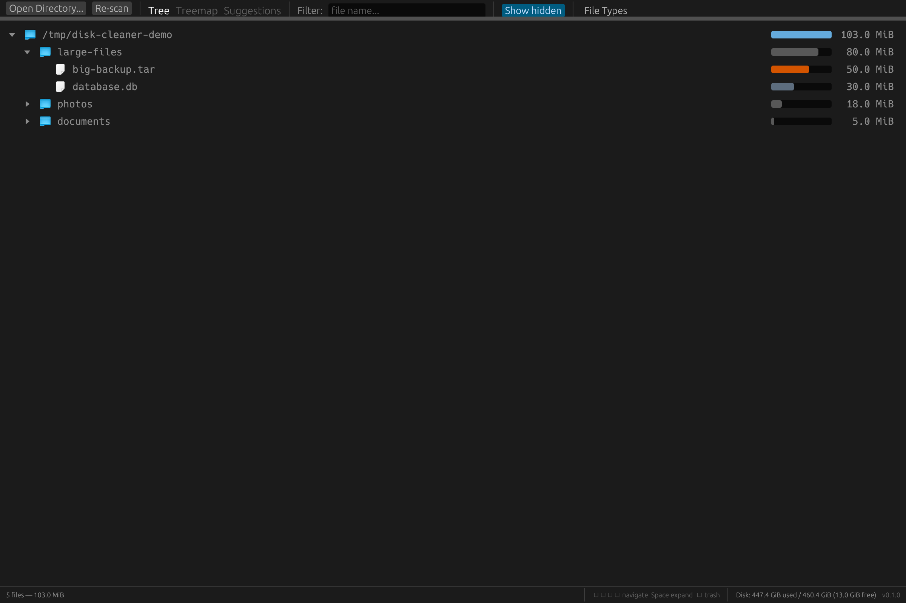
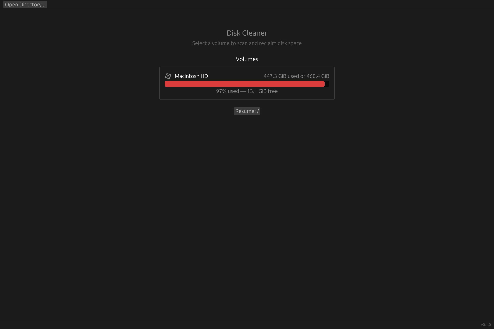

# Disk Cleaner

A fast, native desktop app to visualize disk usage and clean up large files. Built with Rust and [egui](https://github.com/emilk/egui).



## Features

- Scan any directory or volume with parallel traversal
- Tree view sorted by size with proportional size bars
- File type breakdown sidebar (archives, images, documents, etc.)
- Filter files by name
- Treemap visualization
- Trash or delete files directly from the UI
- Resume previous scans
- macOS native file icons

## Screenshots

**Home screen** — pick a volume or open a directory to scan.



**Scan results** — browse the file tree sorted by size, filter by type.


## Install

Requires Rust 1.70+.

```sh
cargo build --release
```

The binary will be at `target/release/disk-cleaner`.

## Usage

```sh
cargo run --release
```

Select a directory or volume to scan. Browse the tree to find large files, then trash or delete them.

## License

MIT
