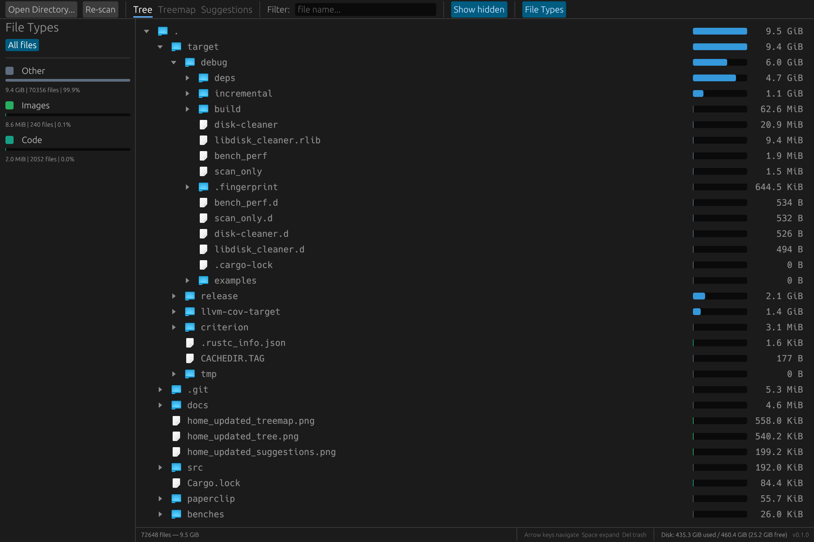
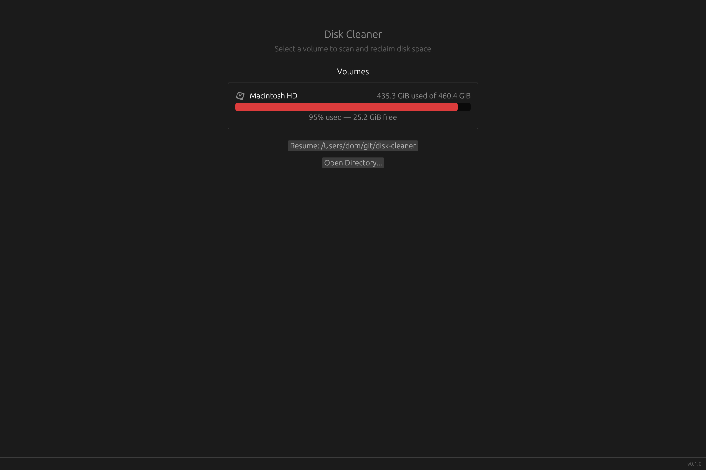
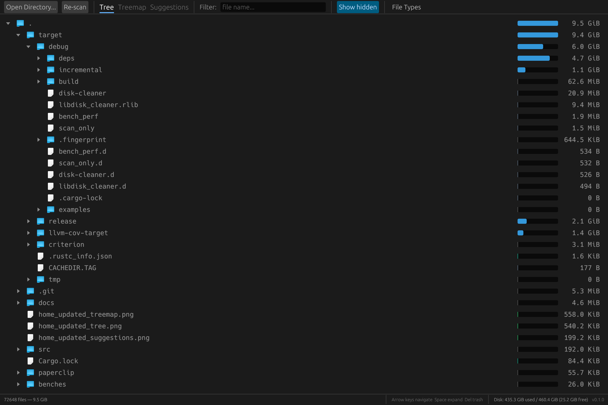
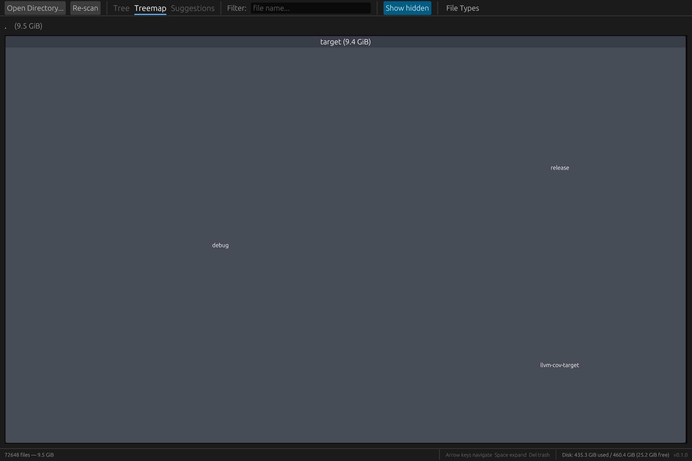

# Disk Cleaner

[](https://github.com/domsleee/disk-cleaner/actions)
[](https://github.com/domsleee/disk-cleaner/releases/latest)
[](LICENSE)

A fast, native cross-platform desktop app to visualize disk usage and clean up large files. Built with Rust and [egui](https://github.com/emilk/egui).

**[Website](https://domsleee.github.io/disk-cleaner/)** | **[Download](https://github.com/domsleee/disk-cleaner/releases/latest)**



## Features

- Cross-platform desktop releases for macOS, Linux, and Windows
- Scan any directory or volume with parallel traversal
- Tree view sorted by size with proportional size bars
- File type breakdown sidebar (archives, images, documents, etc.)
- Filter files by name
- Treemap visualization
- Trash or delete files directly from the UI
- Resume previous scans
- macOS native file icons

## Install

Download the latest release for your platform:

| Platform | Download |
|----------|----------|
| macOS (universal) | [Disk-Cleaner.dmg](https://github.com/domsleee/disk-cleaner/releases/latest) |
| Linux x86_64 | [tar.gz](https://github.com/domsleee/disk-cleaner/releases/latest) |
| Windows x86_64 | [.zip](https://github.com/domsleee/disk-cleaner/releases/latest) |

> **macOS note:** The app is not notarized. On first launch, right-click the app and select "Open" to bypass Gatekeeper.

Or build from source (requires Rust 1.70+):

```sh
git clone https://github.com/domsleee/disk-cleaner.git
cd disk-cleaner
cargo build --release
```

The binary will be at `target/release/disk-cleaner`.

## Screenshots

**Home screen** — pick a volume or open a directory to scan.



**Tree view** — browse the file tree sorted by size, filter by type.



**Treemap** — visual overview of disk usage.



## License

MIT
